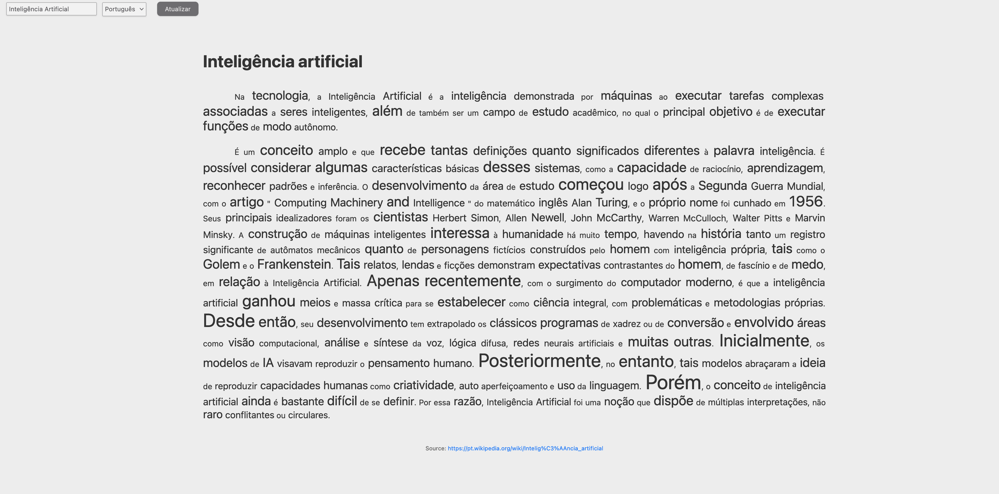
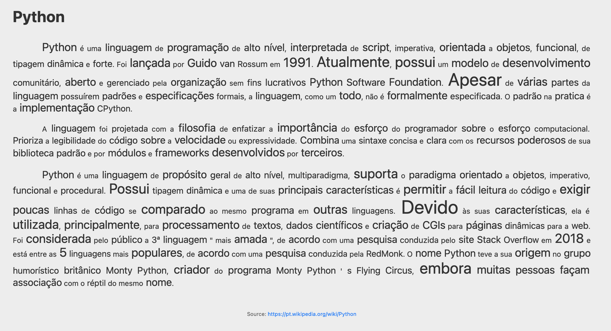
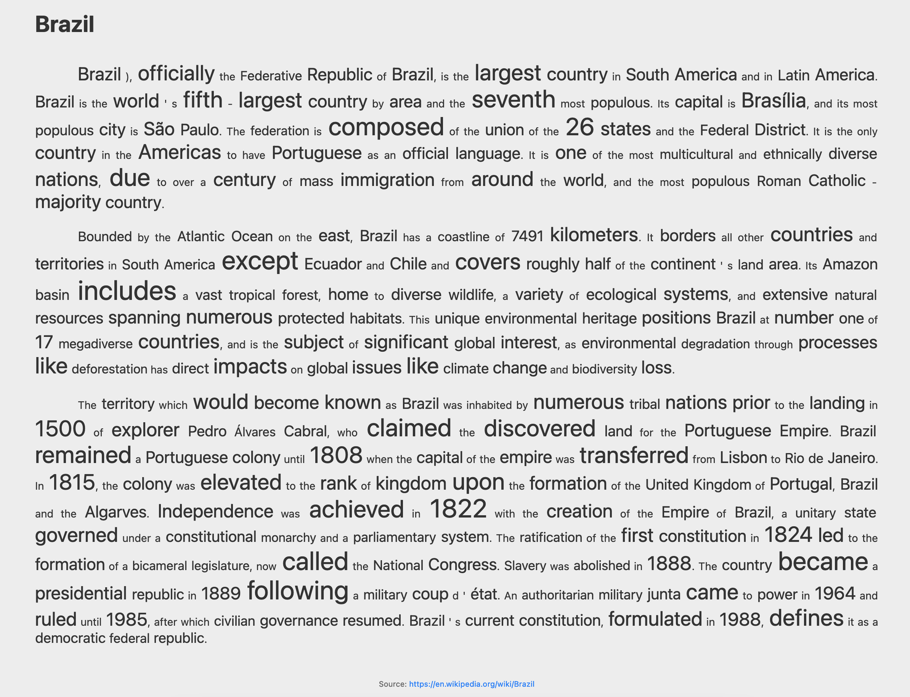

## Introdução
A revolução da Inteligência Artificial (IA) tem sido um dos avanços tecnológicos mais impactantes do século XXI, com aplicações cada vez mais presentes no cotidiano, do lazer ao trabalho, redefinindo paradigmas sociais e influenciando diretamente as tomadas de decisões. Uma consequência dessa expansão da IA foi a elevada criação de diversos modelos, muitas vezes terrivelmente complicados para as necessidades mais simples (em uma clara paráfrase ao poema de Carlos Drummond de Andrade). Sendo que diversos modelos permanecem totalmente invisíveis, ou mais precisamente, são caixas preta para aqueles que os utilizam.

Entretanto, existem diversas aplicações críticas onde é crucial a interpretabilidade dos resultados dos modelos de IA, como elementos de transparência, ética e confiança. Nesse contexto, um modelo é considerado explicável se for possível justificar de uma forma compreensível ao ser humano como as suas saídas (decisões ou previsões) foram produzidas a partir de um conjunto de entradas (dados). Isso é extremamente importante em casos de tomadas de decisões, sendo mais propenso de ter um resultado aceito, além de facilitar detecção e correção de possíveis erros. Sendo, assim, particularmente relevante no contexto de aplicações de IA que têm impacto direto na vida das pessoas, como, por exemplo, nas áreas da saúde, finanças e justiça.

Dessa forma, fica claro a importância da explicabilidade de modelos no campo do Processamento de Linguagem Natural, uma vez que linguagem humana é complexa e sutil, e os modelos de IA que a interpretam podem facilmente cometer erros ou mal-entendidos. Além disso, as decisões tomadas por esses modelos podem ter implicações significativas, portanto, garantir um entendimento claro de como esses modelos processam e interpretam a linguagem é crucial para viabilizá-los no ambiente de produção.

Com base nisso, esse trabalho busca construir uma solução interpretável de sumarização de textos, voltado não apenas a gerar resumos, mas também permitir que os usuários entendam como esses resumos foram criados, destacando as partes (palavras)  mais importantes de cada o texto segundo o modelo. Esse resultado será exibido em um novo documento alterando o tamanho da fonte de cada uma palavra conforme a importância estimada dela para o contexto.

Além disso, optou-se por utilizar das boas práticas de programação e as diretrizes para um código limpo no Python, focado na manutenção do código, além de gerá-lo em uma forma compatível para ser colocado em produção. Isso facilitaria nas etapas posteriores ao NLP, já possuindo um código refatorado e pronto para a utilização. Apesar de notebooks serem uma boa ferramenta de análise e teste, não são vantajosos para modelos de produção.

## Estrutura do Código

O código do repositório está localizado na pasta `src`, onde as tarefas relacionadas ao processamento do texto e a API de visualização. 
### Processamento do Texto
As tarefas relacionadas ao processamento de texto estão implementadas no interior da pasta `language_processing`, onde são executadas as seguintes ações:

#### Obtenção dos Textos

A primeira etapa do projeto consiste na extração dos dados que são obtidos a partir de uma busca na Wikipédia a partir de uma palavra-chave e idioma fornecidos como entrada. O projeto foi inicialmente configurado para buscar termos em português ou inglês, entretanto isso pode ser facilmente expandido. A classe responsável por essa tarefa está implementada em `text_downloader.py`.

Essa classe possibilita armazenar o texto obtido e realizar pequenas substituições de ajuste no texto do sumário extraído, como remover os links de referências, informações entre parêntesis e separador de milhar nos números. 

#### Pré-Processamento
Em seguida é realizado o processamento do texto, dividindo-o em sentenças. Ele é executado pela classe TextProcessor localizada em `text_processor.py` que herda os métodos e atributos da classe anteriormente citada da obtenção dos textos. Por questões de configuração, as demais ações para o processamento do texto foram implementadas na classe que será detalhada a seguir.

#### Modelo
Essa é a parte mais importante do projeto, onde seleciona-se o modelo a ser utilizado. A princípio, optou-se pelo uso de um modelo pré-treinado do *Language-agnostic BERT Sentence Embedding* (LaBSE), em sua versão mais simples, o `smaller-LaBSE`. Esse modelo se destaca pela sua capacidade de gerar representações semânticas de frases em vários idiomas. Sendo baseada na arquitetura de *Transformer*, ele possui um mecanismo de atenção responsável por capturar as interações entre as palavras em uma sentença. Essa atenção permite que o modelo considere a importância relativa de cada palavra em relação às outras durante a geração de representações semânticas das sentenças, sendo, portanto, adequado para essa aplicação.

Para obter a atenção foram inicialmente realizadas inicialmente a tarefa de tokenização, realizada por um tokenizer compatível com o `smaller-LaBSE`. Ele converte cada palavra (ou símbolo) em um (ou mais) tokens representados por um índice que corresponde a um vetor de *embedding*. Além disso, para cada token também é gerado um `token_type_ids`, que será constante nesse problema além de uma máscara de atenção (*attention_mask*), que será alterada, reduzindo a atenção para os *stopwords* e pontuações. Essa ação foi utilizada em vez de removê-los do texto com o objetivo de posteriormente reconstruir o texto inicial.

##### Análise das Camadas de Atenção
O modelo do `smaller-LaBSE` possibilita retornar os estados intermediários de atenção entre os *tokens*, representado por uma lista de tensores de 4 componentes (`batch ✕ camadas_atenção ✕ token ✕ token`). Cada elemento da lista representa esses scores para cada camada de atenção. Sendo assim, elas foram concatenadas (na nova primeira dimensão), resultando em um vetor com 5 componentes. Esse vetor é reduzido tomando a média das 4 primeiras dimensões, resultando em um vetor $1 ✕ tokens$, onde cada índice representará a atenção dada no modelo para cada token na formação do *embedding* do texto. Esse valor da importância a ser dada para cada palavra.

No caso da representação de mais de um token por palavra, ao recombinar para a formação de uma palavra, o valor de atenção tomada foi o máximo valor encontrado pelas partes da palavra. A divisão delas é marcada pelo *##* como início da parte da palavra (cada *token* com *##* possui uma própria representação em *embedding*).

### API de Visualização
Para a exibição dos resultados conforme proposto, foi desenvolvido um servidor utilizando o *FastAPI* para realizar solicitar as requisições do processamento de um texto redirecionando-o para um *endpoint* para exibição do conteúdo final (texto sumarizado explicável). Sendo assim, principal informação exibida é oriunda combinação dos *tokens* e suas respectivas atenções em um formato textual que o destacasse de acordo com o valor. Para tanto, foi realizado p seguinte procedimento de reconstrução textual.

#### Reconstrução do Texto para a API
Os valores de atenção foram normalizados e reescalados com o objetivo de indicar o tamanho da fonte de cada *token* no texto final. Em seguida os esses *tokens* e esses respectivos valores de tamanho da fonte foram combinados em um formato *HTML* onde cada *token* era envolto por *tags* do tipo ``, com o respectivo tamanho de fonte estimado. Esse texto foi combinado e em seguida, os inícios dos parágrafos foram identificados e envoltos pela *tag* `
` para a geração do conteúdo final.

### Instruções para execução
A aplicação desenvolvida está disponibilizada neste [Repositório no GitHub](https://github.com/rurgel/explainable_nlp). Todo seu conteúdo foi desenvolvido utilizando boas práticas de programação, utilizando dos princípios de orientação a objetos além de extensivamente documentada o conteúdo da parte de processamento textual. A motivação para isso é justamente no enfoque de interpretabilidade, pois nesse contexto, é igualmente importante que os códigos também o sejam. Além disso, todo histórico de evolução do projeto pode ser acompanhado ao longo das *branches* e *commits* realizados, além da sua estrutura de planejamento inicial do projeto disponibilizada [aqui](https://github.com/users/rurgel/projects/12).

Há três diferentes formas de inicializar o aplicativo desenvolvido listadas a seguir. Entretanto é importante destacar que, independente da escolha *a primeira execução será mais lenta uma vez que a aplicação realizará o download dos modelos de linguagem* utilizados (no caso, o [smaller-LaBSE](https://huggingface.co/setu4993/smaller-LaBSE)) antes de disponibilizar os endpoints.

O aplicativo foi configurado para executar na porta 8080 do endereço local. Portanto, após a aplicação inicializada (por algum dos meios listados a seguir), basta digitar `0.0.0.0:8080` no navegador para acessá-la.

#### Criação de Ambiente Virtual
Recomenda-se o uso do ambiente virtual em vez de uma execução direta. Para tanto, basta criar um ambiente virtual usando a versão 3.9 do Python usando seu gerenciador de pacotes preferido e ativá-lo.

Em seguida, basta instalar as bibliotecas listadas em `requirements.txt`.
E, por fim, a aplicação será inicializada ao executar o seguinte comando:

`python -m src.app.summary_renderer`

#### Uso do Tox
A etapa da geração de um ambiente virtual pode ser ignorada, caso tenha a biblioteca Tox instalada. A sua chamada pode variar um pouco de acordo com a versão e o sistema operacional utilizado, mas em geral basta apenas executar o seguinte comando a partir da raiz do repositório:

`tox`

Dessa forma toda rotina da criação de um ambiente e execução do comando será automatizada.

#### Criação de um Contêiner

Uma terceira possibilidade está relacionada ao uso de um contêiner Docker. Para isso é necessário ter a aplicação instalada e executar o comando:

`docker build -f docker/Dockerfile .`

Com isso a imagem é criada, podendo ser devidamente montada e acessada.

## Exemplos

A seguir serão exibidos alguns exemplos obtidos na utilização da API desenvolvida. É importante ressaltar que os textos são extraídos diretamente da Wikipédia, sendo assim, o conteúdo pode se modificar conforme atualizações na página.

<b>Página inicial para selecionar a palavra chave para pesquisar um texto e idioma a ser utilizado.</b>
 

   
<b>Página inicial durante a sumarização do texto.</b>
 

   
<b>Exemplo de sumarização de um texto em português.</b>
 

   
<b>Outro exemplo com o conteúdo da sumarização de um texto em português.</b>
 

   
<b>Exemplo com o conteúdo da sumarização de um texto em inglês.</b>
 

